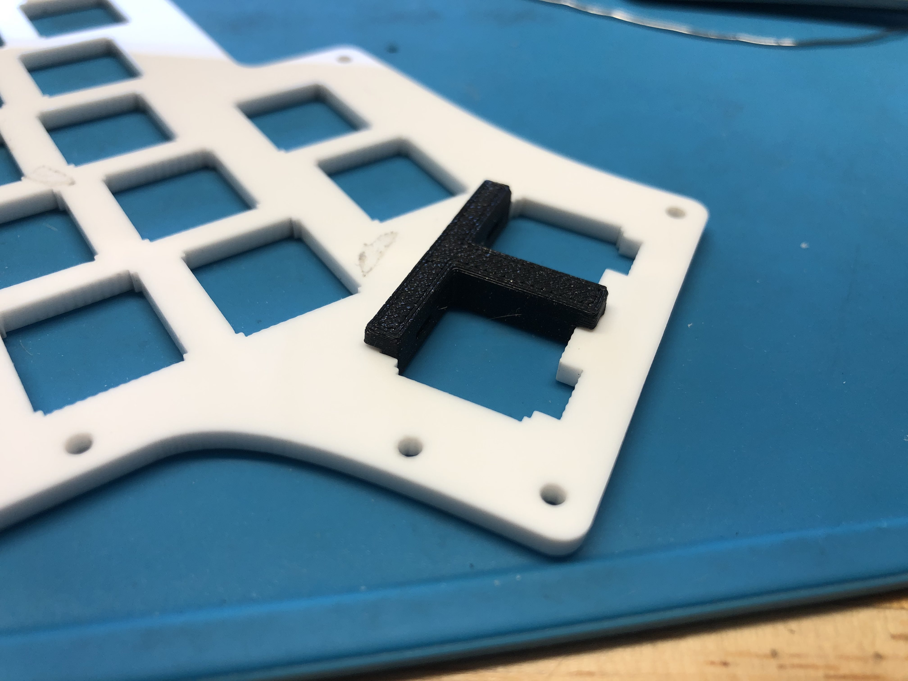
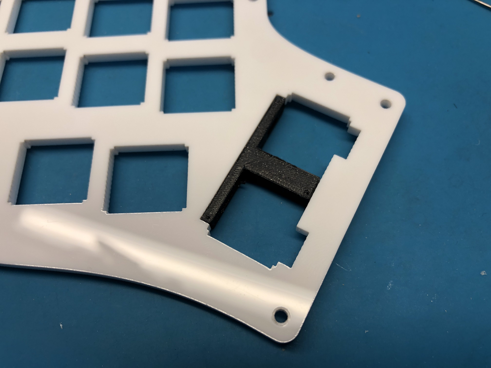

# Iris PE Case Notes

## 1u Adapter for 3mm Plates

For the 3mm acrylic plates, due to the enlarged cutouts at the thumb area for the stabilizer, using two 1u keys there can be a bit loose sometimes. To remedy this, one thing you can do is 3D-print an [adapter for the thumb area](Iris%20PE%201u%20Adapter%20for%203mm%20Plates.stl). This adapter will also the two switches to clip in and stay in place better.

Once printed, insert the adapter from the underside of the plate, as shown here:

Bottom view:

Top view:

